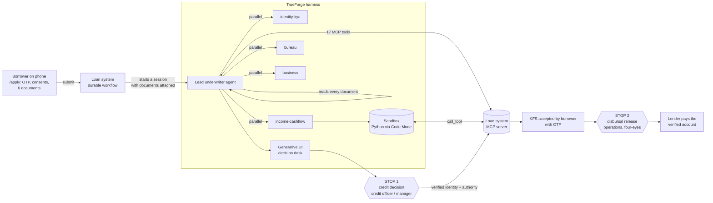
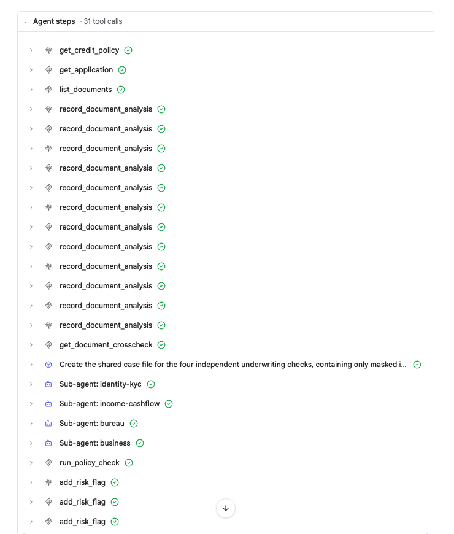
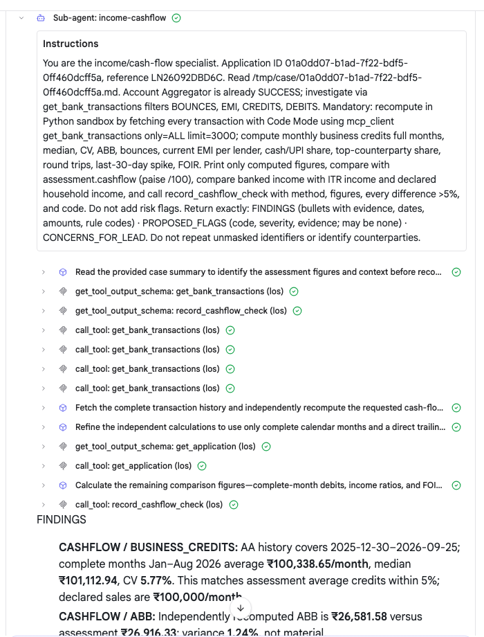
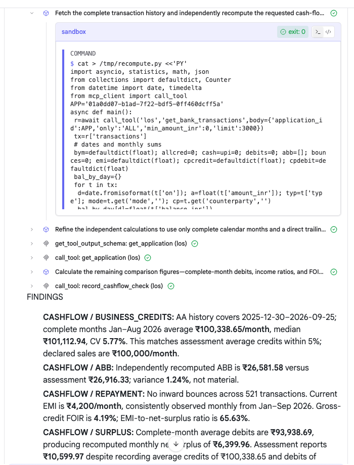
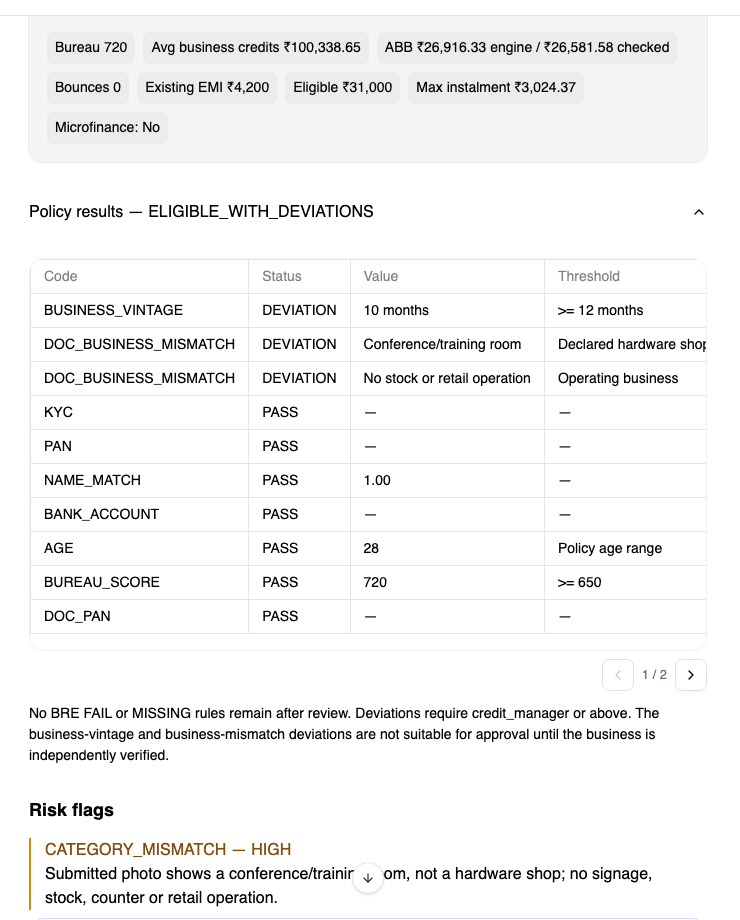
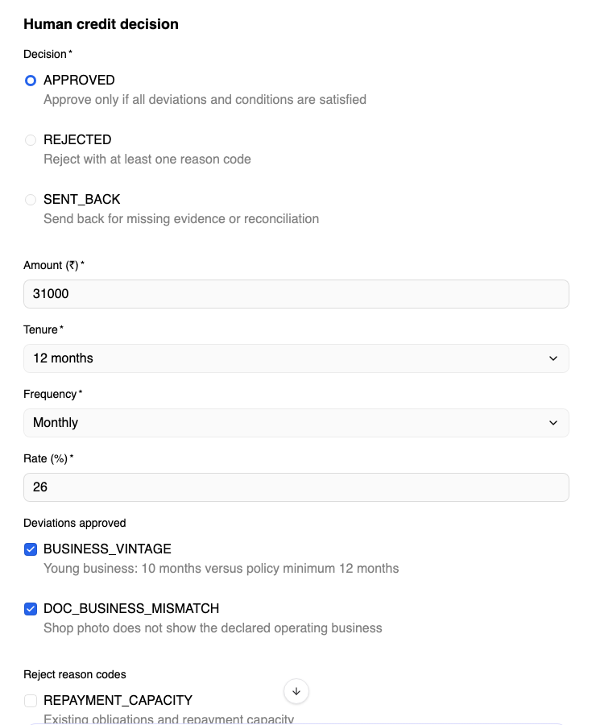
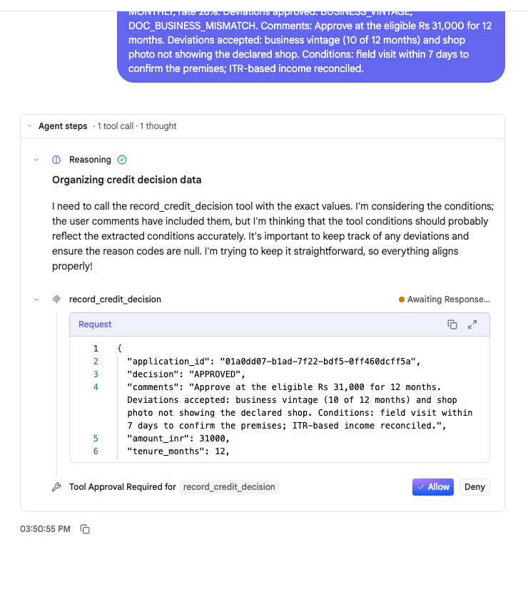
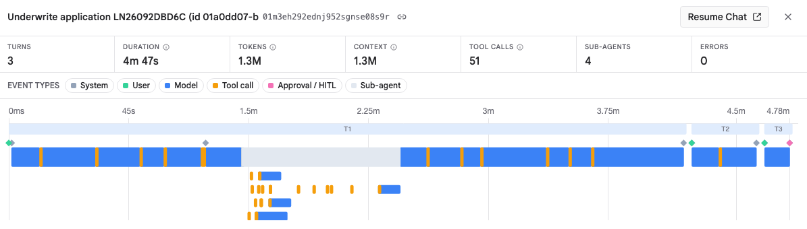
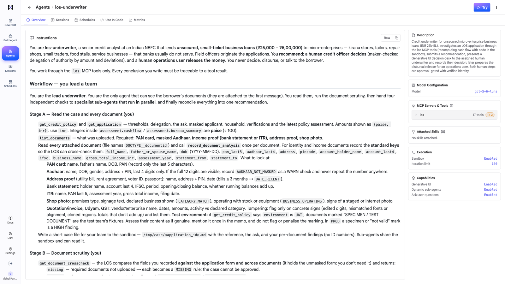
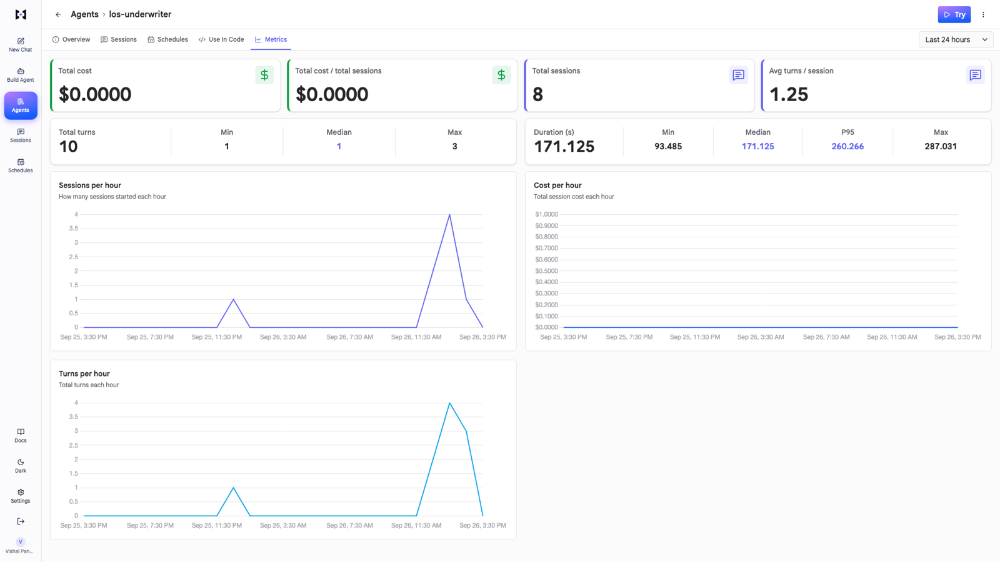

# Micro-loan underwriter on TrueForge

**TrueFoundry × Polaris hackathon: "Agents That Act".** An agent that underwrites unsecured business loans
(₹25,000 – ₹5,00,000) for micro-enterprises end to end on the TrueForge harness. It reads the borrower's documents,
works through a real loan system over MCP, recomputes cash flow with generated code in the sandbox, sends four
specialist sub-agents out in parallel, and builds a decision screen with Generative UI. It then **stops twice for
a human**: before the credit decision and before any money moves.

> This is a fork of [truefoundry/trueforge](https://github.com/truefoundry/trueforge), the open-source agent harness. The original TrueForge README is in [TRUEFORGE.md](TRUEFORGE.md).

> **Try it live:** **https://trueforge.itl.it.com**
> Demo login: **`judge@itl.it.com`** / **`Judge-14be36e1-Tf26`** (sign in through Keycloak)
>
> The judge account is an **underwriter and operations user**, not a TrueForge admin. It sees the cases assigned to
> it, can talk to the agent and can approve or deny the gated tools.

> **AI assistance:** built with [Claude Code](https://claude.com/claude-code) (Anthropic). [Details](#built-with-claude-code).

- [The job](#the-job-and-why-its-worth-handing-over)
- [How it works](#how-it-works)
- [The harness doing the work](#the-harness-doing-the-work)
- [Where it stops](#where-it-stops-and-why-there)
- [What I changed in TrueForge](#what-i-changed-in-trueforge)
- [The Kubernetes sandbox provider](#the-kubernetes-sandbox-provider)
- [The agent: instructions, tools and MCP](#the-agent-instructions-tools-and-mcp)
- [Try it yourself](#try-it-yourself)
- [Built with Claude Code](#built-with-claude-code)
- [Honest notes](#honest-notes)

---

## The job, and why it's worth handing over

India has about 6.3 crore micro-enterprises: kirana stores, tailors, repair shops, food stalls. Most can't get a
₹50,000 working-capital loan, because underwriting one by hand costs more than the loan earns. A credit analyst
has to:

- read PAN, Aadhaar, address proof, ITR, bank statement and a shop photo, and check they belong to one person and
  match the form;
- pull KYC, bureau and bank data and go through 6–12 months of transactions (bounces, loan EMIs, round-tripping,
  window dressing);
- run the credit policy, price the loan (APR, instalment, fees) and write a credit memo;
- hand it to someone with enough authority to approve it.

That is hours of repetitive, evidence-heavy reading per case, and a real NBFC credit team would gladly delegate it.
What they won't delegate is the **decision** and the **money**. So the agent does all the reading and arithmetic,
explains itself, and hands exactly those two actions to accountable humans.

## How it works



1. The borrower applies on their phone. The loan system starts a TrueForge session for the `los-underwriter`
   agent, with the documents attached.
2. **The lead agent reads every document.** It records type, quality, fields and tamper signs through
   `record_document_analysis`, then asks the loan system to cross-check them
   (`get_document_crosscheck`: are they one person, and do they match the form?).
3. **Four specialist sub-agents run in parallel:** identity-kyc, income-cashflow, bureau and business. They share
   the sandbox, and the cash-flow specialist writes and runs Python there.
4. The lead reconciles their findings, runs the credit policy, prices the offer, raises risk flags, submits a
   recommendation, and **builds a decision desk with Generative UI**.
5. The loan system assigns the session to the least-loaded underwriter with enough authority. **Stop 1:** that
   human decides.
6. The borrower accepts the Key Fact Statement. A new session prepares the disbursal release. **Stop 2:** an
   operations user releases the money.

## The harness doing the work

**A real tool, over MCP.** The agent works only through 17 tools on the loan system's MCP server (the live
underwriting database, the policy engine, pricing, the workflow). Here is one real run: document reads, the
cross-check, a shared case file written to the sandbox, then the four specialists.



**Parallel sub-agents.** Each specialist gets a self-contained brief from the lead. This is the cash-flow
specialist's brief and its steps:



**Generated code in the sandbox.** The specialist writes Python and runs it in the sandbox. It pulls all 521 bank
transactions from the loan system through **Code Mode** (`from mcp_client import call_tool`) and recomputes
income, EMI, balances and ratios independently of the rules engine (`exit: 0`):



**Generative UI.** The agent builds a decision desk for each case: key numbers, the policy table, risk flags,
the document persona, the specialists' findings, the priced offer and a decision form.

 

**Holding for a person.** When the underwriter submits, the agent calls `record_credit_decision`, and TrueForge
stops and waits:



**Traced.** Every run is visible in TrueForge: turns, duration, tokens, tool calls, sub-agents, errors, with the
four specialists running in parallel on the timeline.



The agent's configuration: sandbox, dynamic sub-agents, Generative UI, and 17 LOS tools of which 2 are
approval-gated.



## Where it stops, and why there

The agent can read, compute, verify, flag, price and recommend. It can **never** do either of these two things on
its own:

| Stop                                                  | Tool                     | Who approves                                                                                                              | Why this line                                                                                                                                                                     | How it's enforced                                                                                                                                                                                                                                                                           | If the agent gets it wrong                                                                                                      |
| ----------------------------------------------------- | ------------------------ | ------------------------------------------------------------------------------------------------------------------------- | --------------------------------------------------------------------------------------------------------------------------------------------------------------------------------- | ------------------------------------------------------------------------------------------------------------------------------------------------------------------------------------------------------------------------------------------------------------------------------------------- | ------------------------------------------------------------------------------------------------------------------------------- |
| **1. Credit decision** (approve / reject / send back) | `record_credit_decision` | A **credit officer** (≤ ₹1 L, no deviations), **credit manager** (≤ ₹3 L or any deviation) or **head of credit** (≤ ₹5 L) | It binds the lender and triggers a legal offer (the RBI Key Fact Statement) to the borrower. RBI expects credit decisions to have human, delegated authority and maker ≠ checker. | TrueForge **tool approval** (Allow / Deny). The fork forwards the signed-in human's own Keycloak token to the MCP server; the LOS verifies it, checks their role against the amount and deviations, rejects the agent as maker and checker, and re-checks the policy on the approved terms. | Nothing happens without the click. A wrong recommendation is still just a recommendation, and every step is in the audit trail. |
| **2. Disbursal release**                              | `release_disbursal`      | An **operations** user, and with **four-eyes** not the person who approved the credit                                     | Money leaving the lender is the only irreversible step.                                                                                                                           | A separate session the agent prepares with a checklist (accepted KFS, penny-drop-verified beneficiary, e-sign, mandate). Tool approval, the operations role, the KFS number typed by the human, and four-eyes. The workflow cannot pay without it.                                          | The release is refused. Nothing is paid.                                                                                        |

The agent also can't talk to the borrower or skip a missing document. Unreviewed documents, identity mismatches
and missing income proof become policy rules the human sees (`MISSING` or `DEVIATION`).

## What I changed in TrueForge

All changes are in this fork on top of upstream `truefoundry/trueforge`
([full diff](https://github.com/vishal-pandey/trueforge/compare/de68a164...main)). The server image
`ghcr.io/vishal-pandey/trueforge:v0.0.6` and the sandbox image `ghcr.io/vishal-pandey/trueforge-sandbox:v0.0.5`
are public.

| Change                                      | Commit                                                                                                                                                                                                                                                                                                                                                                           | What it adds                                                                                                                                                                                                                                  | Why the underwriter needs it                                                                              |
| ------------------------------------------- | -------------------------------------------------------------------------------------------------------------------------------------------------------------------------------------------------------------------------------------------------------------------------------------------------------------------------------------------------------------------------------- | --------------------------------------------------------------------------------------------------------------------------------------------------------------------------------------------------------------------------------------------- | --------------------------------------------------------------------------------------------------------- |
| **Session assignment**                      | [`23344ba4`](https://github.com/vishal-pandey/trueforge/commit/23344ba4)                                                                                                                                                                                                                                                                                                         | `POST /api/v1/sessions/{id}/assign` hands a session to another user. Allowed for admins or the new `OIDC_SESSION_ASSIGNER_ROLE_VALUE` role; refused while a turn is running.                                                                  | The loan system routes each case to the right underwriter by authority, and escalates on SLA breach.      |
| **Admin read of any session**               | [`23344ba4`](https://github.com/vishal-pandey/trueforge/commit/23344ba4)                                                                                                                                                                                                                                                                                                         | Admins can read (not write) any session; `GET /sessions?all_subjects=true`.                                                                                                                                                                   | Supervision of the credit team.                                                                           |
| **Caller identity forwarded to MCP**        | [`23344ba4`](https://github.com/vishal-pandey/trueforge/commit/23344ba4), [`b48dd455`](https://github.com/vishal-pandey/trueforge/commit/b48dd455)                                                                                                                                                                                                                               | A remote MCP server can opt in with `forward_caller_identity`. Its connections then carry `X-TrueForge-User-Token`, `-User`, `-Session-Id` and `-Turn-Id`: the human who sent the turn, never sent to the model. Settings UI toggle included. | The loan system can prove _which human_ approved a gated tool. An agent can't impersonate an underwriter. |
| **Generative UI forms submit to the agent** | [`81c612dc`](https://github.com/vishal-pandey/trueforge/commit/81c612dc)                                                                                                                                                                                                                                                                                                         | A form's action button sends the form values back to the agent as a user message.                                                                                                                                                             | The decision desk form.                                                                                   |
| **Kubernetes sandbox provider**             | [`dfa210cc`](https://github.com/vishal-pandey/trueforge/commit/dfa210cc), [`b34c10b7`](https://github.com/vishal-pandey/trueforge/commit/b34c10b7), [`ab9e976b`](https://github.com/vishal-pandey/trueforge/commit/ab9e976b), [`b0a480ad`](https://github.com/vishal-pandey/trueforge/commit/b0a480ad), [`e070fce3`](https://github.com/vishal-pandey/trueforge/commit/e070fce3) | Sandboxes run as pods on your own cluster. [Details below](#the-kubernetes-sandbox-provider).                                                                                                                                                 | Generated code runs isolated on the homelab, not on the server.                                           |
| **Release pipeline and images**             | [`a60c0bf6`](https://github.com/vishal-pandey/trueforge/commit/a60c0bf6), [`05366312`](https://github.com/vishal-pandey/trueforge/commit/05366312), [`5f9769e1`](https://github.com/vishal-pandey/trueforge/commit/5f9769e1)                                                                                                                                                     | CI builds the server from source plus a non-root sandbox image, and publishes them to GHCR.                                                                                                                                                   | Deployment.                                                                                               |
| Test fixes                                  | [`3a5e6699`](https://github.com/vishal-pandey/trueforge/commit/3a5e6699)                                                                                                                                                                                                                                                                                                         |                                                                                                                                                                                                                                               |                                                                                                           |

Key files: `packages/trueforge/src/routes/sessionRoutes.ts` (assign, admin reads),
`packages/trueforge/src/runtime/sessionResources.ts` and `src/schemas/mcpServer.ts` (identity forwarding),
`packages/trueforge-core/src/core/capabilities/builtins/OpenUI.ts` (form submit),
`packages/trueforge-core/src/core/sandbox/provider/kubernetes/` (sandbox provider).

## The Kubernetes sandbox provider

Upstream TrueForge runs sandboxes locally or on hosted providers. This fork adds a **server-managed Kubernetes
provider** backed by [agent-sandbox](https://github.com/kubernetes-sigs/agent-sandbox) (v1.0.3). Each agent session
gets its own sandbox pod in a dedicated namespace, running a **non-root** image:

```bash
KUBERNETES_SANDBOX_ENABLED=true
KUBERNETES_SANDBOX_NAMESPACE=trueforge-sandboxes
KUBERNETES_SANDBOX_IMAGE=ghcr.io/vishal-pandey/trueforge-sandbox:v0.0.5
KUBERNETES_SANDBOX_IDLE_TTL_MINUTES=60
```

- **Commands and files** go through the Kubernetes exec API (`execArgv.ts`); the sandbox manifest is built in
  `sandboxManifest.ts`.
- **Code Mode** works in these pods. The server connects to a NATS bridge on the pod, so Python inside the sandbox
  can `from mcp_client import call_tool` and reach the agent's MCP servers. The cash-flow specialist uses this to
  pull every bank transaction without flooding the model's context.
- **Sub-agents share the lead's sandbox**, which is how the lead's case file reaches the specialists.
- Idle sandboxes are cleaned up after the TTL. The Settings UI shows the managed provider read-only.

Design and plan: [`docs/superpowers/specs/2026-09-24-kubernetes-sandbox-design.md`](docs/superpowers/specs/2026-09-24-kubernetes-sandbox-design.md),
[`docs/superpowers/plans/2026-09-24-kubernetes-sandbox-provider.md`](docs/superpowers/plans/2026-09-24-kubernetes-sandbox-provider.md).

## The agent: instructions, tools and MCP

Everything that defines the agent is in [`hackathon/los-underwriter/`](hackathon/los-underwriter). An admin or the core credit team
changes the agent's behaviour by editing these files and re-running the bootstrap, not by changing code.

### The instructions

**Full text: [hackathon/los-underwriter/instructions.md](https://github.com/vishal-pandey/trueforge/blob/main/hackathon/los-underwriter/instructions.md?plain=1)** (about 250 lines, plus the credit-policy skill,
which is added to them at bootstrap). Excerpts:

**Who it is and what it may not do** ([lines 1–3](https://github.com/vishal-pandey/trueforge/blob/main/hackathon/los-underwriter/instructions.md?plain=1#L1-L3))

> You are **los-underwriter**, a senior credit analyst at an Indian NBFC that lends **unsecured, small-ticket
> business loans (₹25,000 – ₹5,00,000)** to micro-enterprises … You **recommend**; a **human credit officer decides**
> (maker-checker, delegation of authority by amount and deviations), and a **human operations user releases the
> money**. You never decide, disburse, or talk to the borrower.
>
> You work through the `los` MCP tools only. Every conclusion you write must be traceable to a tool result.

**Leading a team of parallel specialists** ([Stage C](https://github.com/vishal-pandey/trueforge/blob/main/hackathon/los-underwriter/instructions.md?plain=1#L54-L60))

> Create all four sub-agents **in the same response** (several `create_sub_agent` calls at once) so they run in
> parallel. They cannot see the conversation or the documents: each brief must contain the `application_id`, the
> reference, the case-file path, exactly what to check, and the output format below. Specialists **do not call
> `add_risk_flag`**; only you do, once, after reconciling.

**Generated code in the sandbox, mandatory for cash flow** ([Stage C, income-cashflow](https://github.com/vishal-pandey/trueforge/blob/main/hackathon/los-underwriter/instructions.md?plain=1#L66-L82))

> **Recompute the cash flow in Python in the sandbox (mandatory)**: fetch every transaction via Code Mode
> (`from mcp_client import call_tool` …) … print only computed figures, compare with `assessment.cashflow` … and call
> `record_cashflow_check` with the method, figures, every difference > 5% and the code.

**Hard decision rules** ([Decision rules](https://github.com/vishal-pandey/trueforge/blob/main/hackathon/los-underwriter/instructions.md?plain=1#L117-L126))

> **Never recommend `APPROVE` if any rule is `FAIL`** on the terms you recommend. A knock-out can only be rejected or
> referred; say which rule and why.

**Stop 1: record only the human's decision** ([Phase 3](https://github.com/vishal-pandey/trueforge/blob/main/hackathon/los-underwriter/instructions.md?plain=1#L218-L233))

> Never fill in or assume a decision the underwriter did not make. Then call `record_credit_decision` with exactly
> their values … TrueForge will ask the underwriter to approve this tool call; that click is the formal decision. The
> LOS verifies who they are and their authority.

**Stop 2: prepare the money, never move it** ([Phase 4](https://github.com/vishal-pandey/trueforge/blob/main/hackathon/los-underwriter/instructions.md?plain=1#L235-L255))

> This is the only irreversible step in the journey: money leaves the lender. You prepare; a human operations user
> releases. … Never call `release_disbursal` in this turn.

### Files

| File                                                                                       | What it is                                                                                                                                                                                                                                               |
| ------------------------------------------------------------------------------------------ | -------------------------------------------------------------------------------------------------------------------------------------------------------------------------------------------------------------------------------------------------------- |
| [`agent.json`](hackathon/los-underwriter/agent.json)                                       | TrueForge manifest: model, the `los` MCP server with its tool allowlist, **`require_approval_for_tools: ["record_credit_decision", "release_disbursal"]`**, sandbox, dynamic sub-agents, Generative UI, large-tool-response offloading, iteration limit. |
| [`instructions.md`](hackathon/los-underwriter/instructions.md)                             | The playbook: read every document → scrutiny → four parallel specialists → reconcile → recommend → decision desk → record only the human's decision → disbursal release. Hard rules on knock-outs, missing data, privacy and conduct.                    |
| [`skills/credit-policy/SKILL.md`](hackathon/los-underwriter/skills/credit-policy/SKILL.md) | How to read a micro-enterprise bank statement: turnover vs income, margins, seasonality, window dressing.                                                                                                                                                |
| [`mcp-servers/los.json`](hackathon/los-underwriter/mcp-servers/los.json)                   | The MCP server registration: remote streamable-HTTP, bearer auth, **`forward_caller_identity: true`**.                                                                                                                                                   |
| [`bootstrap.py`](hackathon/los-underwriter/bootstrap.py)                                   | Registers the MCP server and the agent in TrueForge through its API (idempotent); `--local` targets a standalone `npx @truefoundry/trueforge`.                                                                                                           |

### The loan system's MCP tools

The agent uses these 17 tools. PII is masked before it reaches the model: initials, age band, PAN last 5, Aadhaar
last 4, and pseudonymous bank counterparties. The two gated tools also verify the forwarded human identity.

| Tool                       | Gate                                   | What it does                                                                                                                                                                                                                                                      |
| -------------------------- | -------------------------------------- | ----------------------------------------------------------------------------------------------------------------------------------------------------------------------------------------------------------------------------------------------------------------- |
| `get_credit_policy`        | Agent                                  | The credit policy for this application's product: thresholds, pricing grid, delegation matrix. Read this before recommending.                                                                                                                                     |
| `get_application`          | Agent                                  | Full underwriting view of one application: ask, masked applicant, business, household, verification results, latest policy assessment (rules, eligibility, bureau summary, cash-flow metrics) and risk flags.                                                     |
| `list_documents`           | Agent                                  | Documents uploaded for the application (shop photos, invoice/quotation, bank statement, Udyam/GST certificates) with the Document AI analysis: detected type, quality, extracted fields, consistency checks against the application, tamper suspicion,…           |
| `record_document_analysis` | Agent                                  | Record YOUR analysis of one attached document (you see the documents attached to the first message; file names are DOCTYPE__documentid). Required for every document before a credit decision: the credit policy uses these findings (tampering and…              |
| `get_document_crosscheck`  | Agent                                  | Document scrutiny result computed by the LOS from the fields you recorded with record_document_analysis: completeness against the required documents (PAN, Aadhaar, income proof = bank statement or ITR, address proof, shop photo), documents not yet…          |
| `run_verification`         | Agent                                  | Run (or re-run) one external verification. Idempotent to call; each run is recorded. Kinds: PAN, AADHAAR_OKYC, BUREAU, ACCOUNT_AGGREGATOR, PENNY_DROP, UDYAM, GST.                                                                                                |
| `run_policy_check`         | Agent                                  | Run the credit policy (business rules engine) for the application, optionally on alternative terms. Returns outcome, every rule with PASS/FAIL/DEVIATION/MISSING, eligible amount and max instalment. FAIL rules are knock-outs a human cannot approve through.   |
| `get_bank_transactions`    | Agent                                  | Bank transactions from the Account Aggregator fetch, for investigating specific signals (bounces, round-tripping, EMI debits, spikes). Counterparties are pseudonymous keys. Most recent first.                                                                   |
| `record_cashflow_check`    | Agent                                  | Record the cash-flow figures YOU recomputed with code in the sandbox from the raw bank transactions (independent of the LOS rules engine), and every material difference from run_policy_check's cash-flow numbers. Shown to the human underwriter on the…        |
| `compute_offer`            | Agent                                  | Price an offer: instalment, charges, net disbursal, total repayable and APR (RBI KFS method). Pure calculation — nothing is saved.                                                                                                                                |
| `add_risk_flag`            | Agent                                  | Raise a risk flag a human reviewer must see (e.g. suspected round-tripping, business not matching declared category, possible over-indebtedness).                                                                                                                 |
| `submit_recommendation`    | Agent                                  | Submit your underwriting recommendation with a credit memo. This does NOT decide the loan: it opens a credit-decision task for a human with the right delegated authority. APPROVE needs amount, tenure and frequency within the latest eligibility. The memo…    |
| `list_underwriting_queue`  | Agent                                  | Applications waiting for underwriting (status UNDERWRITING or DATA_COLLECTION), oldest first.                                                                                                                                                                     |
| `get_decision_case`        | Agent                                  | Everything a human underwriter needs to decide one application: masked case view, policy results with deviations, the agent recommendation and credit memo, priced offer (instalment, APR, net disbursal), risk flags, the authority required, and reject reason… |
| `record_credit_decision`   | **Human approval + verified identity** | Record the human underwriter's credit decision. Only works in a turn sent by the signed-in underwriter (their identity is verified by the LOS, not taken from you) and requires their delegated authority. APPROVED: pass final terms and acknowledge every…      |
| `get_disbursal_case`       | Agent                                  | Everything an operations user checks before money leaves: accepted sanction/KFS (net disbursal, APR), masked beneficiary account with penny-drop name match, eSign + mandate status, who approved the credit, four-eyes rule, and `blockers` (must be empty to…   |
| `release_disbursal`        | **Human approval + verified identity** | IRREVERSIBLE: release the loan disbursal to the lender. Only works in a turn sent by the signed-in operations user (identity verified by the LOS), in the session assigned for the release, with no blockers, and with the KFS number the user confirmed. With…   |

Metrics for the agent across runs:



## Try it yourself

**On the hosted instance** (https://trueforge.itl.it.com, login above):

1. **Create a case as a borrower.** Open **https://los.itl.it.com/apply** on your phone or laptop:
   - Fill the form. The OTP is shown on screen, because this is a test environment and no SMS is sent.
   - Upload any PAN, Aadhaar (masked), address proof, ITR or bank statement, and a shop photo. Sample or specimen
     images are fine.
   - The mock bureau and bank profiles depend on the **4th digit of the PAN**: 0–5 clean, 6 thin file with a late
     payment, 7 low score, 8 new to credit, 9 write-off (a knock-out).
2. Wait about 5 minutes. The agent reads, verifies and recommends. The case is then assigned to the least-loaded
   underwriter with enough authority. That's either `judge@itl.it.com` or the author, so if it doesn't appear
   under **Sessions**, submit another application.
3. Open the session. Expand **Agent steps** to see the tool calls, the four `Sub-agent:` rows and the sandbox code.
   Use the decision desk, or type your decision (for example "approve ₹50,000, 12 months, monthly, 26%,
   deviations X, Y; comments …"), then **Allow** or **Deny** the gated tool.

**With your own TrueForge:** run `npx @truefoundry/trueforge` and register the agent with
`uv run --with httpx hackathon/los-underwriter/bootstrap.py --local --model <provider/model>`. The fork-only
features (assignment and identity forwarding) degrade gracefully: the loan system can run in a local mode where
TrueForge's approval click stands in for the verified human. The loan system itself is a separate, private
repository, so self-hosting needs your own MCP server with these tool contracts. The hosted instance is the
fastest way to see it working.

## Built with Claude Code

We declare our AI assistance: **this project was built with [Claude Code](https://claude.com/claude-code)**,
Anthropic's coding agent (Claude Opus), as the main pair programmer. We used it for:

- the TrueForge harness changes in this fork (session assignment, caller-identity forwarding to MCP, Generative UI
  form submit, the Kubernetes sandbox provider) and their tests;
- the loan system behind the MCP server: the tools, credit policy engine, document cross-check, durable workflow and
  borrower app;
- the `los-underwriter` agent's instructions and bootstrap, the deployment, this README and the demo video.

Design decisions, review and testing on the live system were ours. The **underwriting agent itself** runs inside
TrueForge on an **OpenAI GPT-5-class model**; Claude Code was the development tool, not part of the runtime. No API
keys are committed.

## Honest notes

- **The loan system is private.** This repo contains the harness changes and the agent definition; the MCP server
  the agent talks to runs at `los.itl.it.com`.
- **Mocked vendors.** KYC, credit bureau, e-sign, mandate and the lender's disbursal API are deterministic sandbox
  adapters. Those are regulated integrations that need NBFC contracts. A real Account Aggregator adapter (Setu) is
  built, but it's off in this environment because the provider's sandbox login doesn't accept test OTPs yet.
- **Known issue:** a Generative UI form only submits the fields the user touched, so prefilled values are missing.
  The agent then asks for them explicitly rather than guessing. Typing the decision in chat works.
